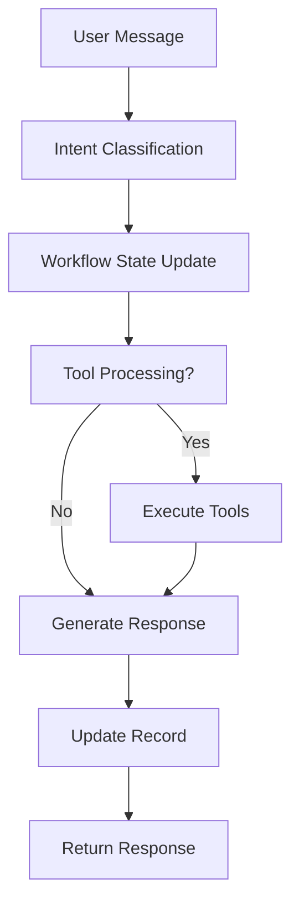

Bây giờ tôi đã đọc được code chính của hệ thống. Hãy để tôi phân tích chi tiết cho bạn về dự án **Robot AI Workflow**:

# Phân tích Code Dự án Robot AI Workflow

## 🏗️ **Tổng quan Kiến trúc**

Đây là một **hệ thống chatbot thông minh** sử dụng **workflow-based conversation** với các tính năng nâng cao:

### **1. Cấu trúc Dự án**
```
robot-ai-workflow/
├── app.py                 # FastAPI main application
├── worker_tools.py        # Background worker cho tools
├── config.yml             # Cấu hình LLM providers
├── docker-compose.yml     # Container orchestration
├── src/
│   ├── chatbot/          # Core chatbot logic
│   ├── channel/          # Redis, MySQL, RabbitMQ clients
│   ├── tools/            # Tool interface system
│   └── utils/            # Utility functions
```

### **2. Công nghệ sử dụng**
- **Backend**: FastAPI, Python asyncio
- **Database**: MySQL (bot configs), Redis (session cache)
- **Message Queue**: RabbitMQ (background tasks)
- **LLM Providers**: OpenAI, Groq, Gemini
- **Containerization**: Docker + Docker Compose

---

## 🔧 **Các Thành phần Chính**

### **1. App.py - Main Application**
```python
# Các endpoint chính:
- GET /robot-ai-workflow/api/v1/database/listBot      # Liệt kê bots
- POST /robot-ai-workflow/api/v1/database/insertBot   # Tạo bot mới  
- POST /robot-ai-workflow/api/v1/bot/initConversation # Khởi tạo cuộc hội thoại
- POST /robot-ai-workflow/api/v1/bot/webhook          # Xử lý tin nhắn
```

**Đặc điểm nổi bật:**
- **Async/Await** để xử lý concurrent requests
- **Redis caching** cho session management
- **Background task processing** với RabbitMQ
- **Multi-provider LLM support** (OpenAI, Groq, Gemini)

### **2. Policies.py - Core Conversation Logic**
Đây là **trái tim** của hệ thống:

```python
class PoliciesWorkflow:
    async def process(self, scenario, message, record, ...):
        # 1. Intent Classification (LLM + Regex)
        # 2. Workflow State Management  
        # 3. Tool Integration
        # 4. Response Generation
```

**Workflow State Machine:**
- Mỗi conversation có `NEXT_ACTION`, `CUR_ACTION`, `HISTORY_QUESTION`
- **Scenario-driven**: Bot theo scenario được định nghĩa trước
- **Intent-based routing**: Phân loại ý định và chuyển state
- **Tool integration**: Tích hợp pronunciation checker, grammar checker

### **3. Scenario System**
```python
# Scenario structure:
{
  "TITLE": "Greeting",
  "FLOWS": {
    "hello": [{"RESPONSE": ["Hi there!"], "NEXT_ACTION": 1}],
    "fallback": [{"RESPONSE": ["I don't understand"], "NEXT_ACTION": 0}]
  },
  "MAX_LOOP": 3
}
```

---

## 🚀 **Tính năng Nâng cao**

### **1. Multi-Agent Tool System**
```python
# Tool integration với async processing
TOOL_OBJECTS = {
    "PRONUNCIATION_CHECKER_TOOL": ...,
    "GRAMMAR_CHECKER_TOOL": ...,
}
```

**Workflow tool execution:**
1. **Parallel tool execution** trong RabbitMQ
2. **Results caching** trong Redis
3. **Tool chaining** - tool này có thể trigger tool khác
4. **Sub-conversation** cho complex tools

### **2. Profile & Memory System**
```python
# User profile extraction
system_extraction_profile = await call_api_get_user_profile(conversation_id)

# Memory system với RabbitMQ
rabbitmq_client.send_task({
    "task_name": "PIKA_MEMORY",
    "conversation_id": conversation_id,
    "history": [...]
})
```

### **3. Multi-Language & Media Support**
```python
record_new.update({
    "LANGUAGE": cur_action.get("LANGUAGE"),
    "MOOD": cur_action.get("MOOD"), 
    "IMAGE": cur_action.get("IMAGE"),
    "VIDEO": cur_action.get("VIDEO"),
    "VOICE_SPEED": cur_action.get("VOICE_SPEED")
})
```

---

## 📊 **Luồng Xử lý Chính**

### **1. Conversation Flow**


### **2. Tool Processing Pipeline**
```python
# Async tool processing
async def process_tools():
    1. Push tasks to RabbitMQ queue
    2. Workers process tools in parallel  
    3. Results cached in Redis
    4. Main process polls for results
    5. Integrate results into response
```

---

## 💡 **Điểm Mạnh của Hệ thống**

### **1. Scalability**
- **Microservices architecture** với Docker
- **Horizontal scaling** với multiple workers
- **Async processing** cho high throughput
- **Caching strategy** với Redis

### **2. Flexibility**  
- **Plugin-based tools** - dễ thêm tools mới
- **Multi-provider LLM** - không phụ thuộc 1 provider
- **Scenario-driven** - dễ customize conversation flow
- **Multi-modal support** - text, audio, image, video

### **3. Reliability**
- **Error handling** với try-catch toàn diện
- **Retry mechanisms** trong workers
- **State persistence** với Redis + MySQL
- **Health checks** trong Docker Compose

---

## 🎯 **Use Cases Chính**

### **1. Educational Chatbots**
- **Pronunciation training** với feedback
- **Grammar checking** và correction
- **Interactive learning scenarios**

### **2. Customer Service**
- **Multi-step workflows** cho complex queries
- **Tool integration** cho external systems
- **Conversation memory** cho context

### **3. AI Agents**
- **Task-oriented dialogues**
- **Multi-turn conversations** với state management
- **Integration** với external APIs/tools

---

## 🔍 **Đánh giá Kỹ thuật**

### **Điểm Mạnh:**
✅ **Architecture design** rất solid với separation of concerns  
✅ **Async programming** được implement tốt  
✅ **Error handling** comprehensive  
✅ **Caching strategy** hiệu quả  
✅ **Tool system** flexible và extensible  

### **Điểm cần cải thiện:**
⚠️ **Code complexity** - policies.py quá lớn (1000+ lines)  
⚠️ **Documentation** - thiếu comment chi tiết  
⚠️ **Testing** - chưa thấy unit tests  
⚠️ **Configuration** - hardcode một số values  

---

## 📋 **Tổng kết**

Đây là một **hệ thống chatbot enterprise-grade** với:
- **Modern architecture** (FastAPI + async + microservices)
- **Advanced features** (multi-agent, tools, memory)
- **Production-ready** (Docker, monitoring, error handling)
- **Highly customizable** (scenario-driven, multi-provider)

Hệ thống phù hợp cho các **use case phức tạp** cần **multi-turn conversations**, **tool integration**, và **high scalability**. Code quality tổng thể **tốt** nhưng cần **refactoring** để giảm complexity và improve maintainability.

Bạn có muốn tôi đi sâu vào phân tích **component cụ thể** nào không?