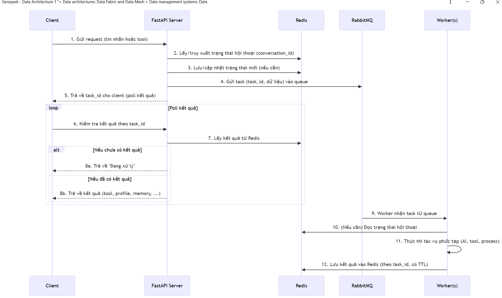

1. Strategic Approaches to Understanding GitHub Repositories: https://github.com/DoanNgocCuong/home/blob/main/1.%20L%E1%BA%ADp%20tr%C3%ACnh%20n%C3%B3i%20chung/3.%20Strategic%20Approaches%20to%20Understanding%20GitHub%20Repositories%20-%20Genspark%2020250626.md

2. How to vẽ kiến trúc REDIS với RABBITMQ
```bash
Em cho manus đọc phân tích Redis với RabbitMQ -> ra 1 file .md phân tích kèm code Xong em dùng Genspark vẽ lại anh ạ. Ngon phết ạ
```
