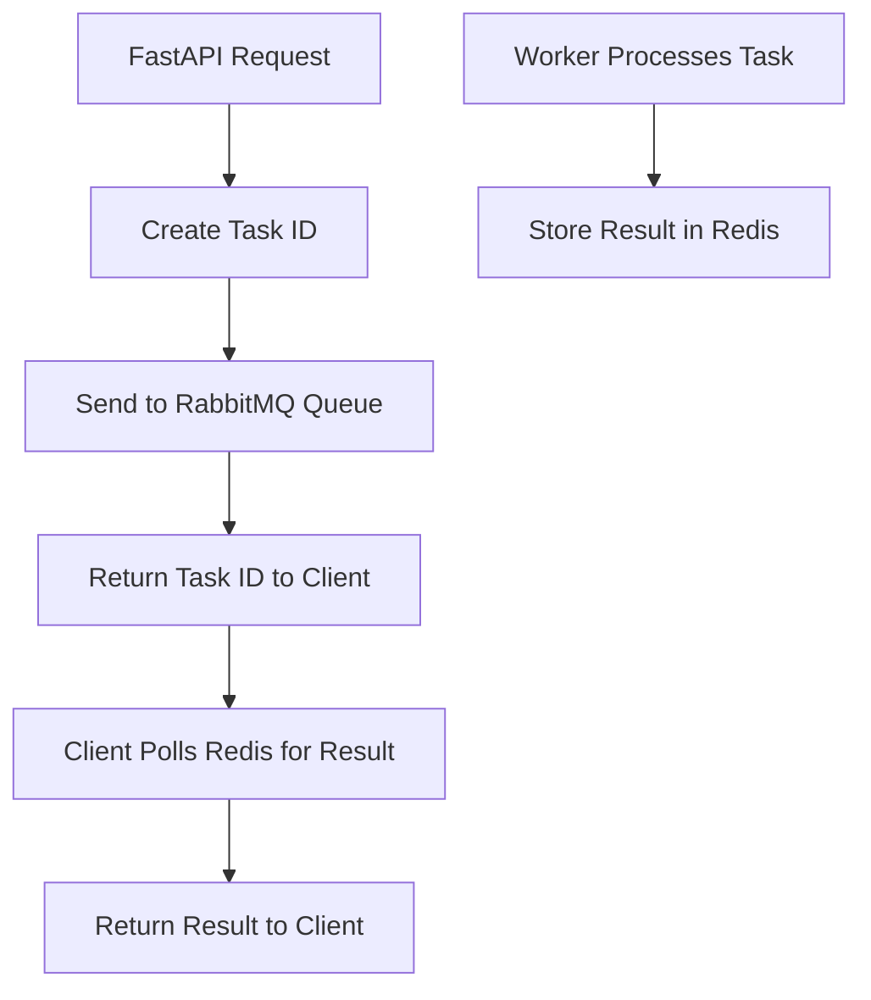
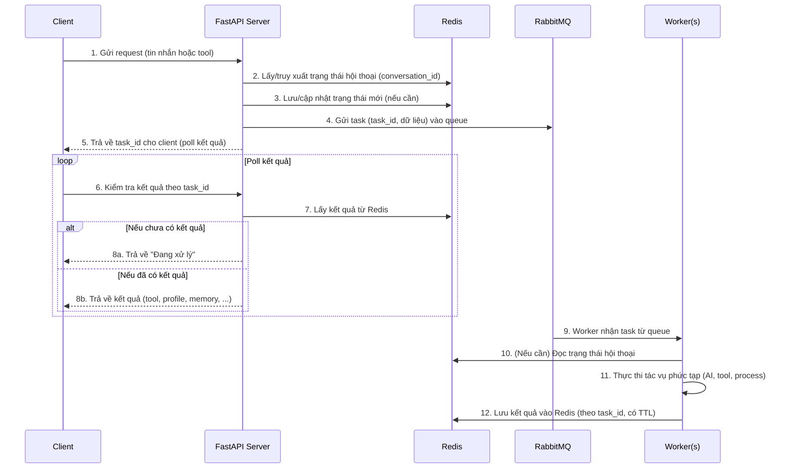

# 🔍 Phân tích Chi tiết Redis và RabbitMQ trong Robot AI Workflow

## 📊 Tổng quan Infrastructure

Dựa trên phân tích code từ GitHub repository, đây là một **hệ thống chatbot enterprise-grade** với kiến trúc **microservices** sử dụng **Redis** và **RabbitMQ** làm backbone cho **session management** và **background task processing**.

---

## 🏗️ **Kiến trúc Infrastructure (Docker Compose)**

### **Services Configuration:**
```yaml
services:
  robot-ai-workflow:          # FastAPI main server
  redis:                      # Session cache & data storage  
  rabbitmq:                   # Message queue for background tasks
  robot-ai-workflow-worker:   # Background workers (10 replicas)
```

### **Đặc điểm Infrastructure:**
- **Containerized deployment** với Docker Compose
- **Horizontal scaling** với 10 worker replicas
- **Resource limits** cho RabbitMQ (2 CPU cores, 512MB RAM)
- **Health checks** cho service reliability
- **External network** cho inter-service communication

---

## 🔴 **Redis - Session Management & Caching**

### **1. Redis Configuration**
```python
# Redis Client Implementation
class RedisClient:
    def __init__(self, host, port, password):
        self.redis_client = redis.StrictRedis(
            host=host,
            port=port, 
            password=password,
            decode_responses=True
        )
```

**Docker Configuration:**
```yaml
redis:
  image: redis:7.2.4
  command: >
    redis-server --requirepass ${REDIS_PASSWORD} 
    --maxmemory 12024mb 
    --maxmemory-policy allkeys-lru
```

### **2. Redis Usage Patterns**

#### **A. Session Storage**
```python
# Conversation state persistence
REDIS_CLIENT.set(conversation_id, json.dumps(conversation, ensure_ascii=False))

# Session retrieval
conversation = json.loads(REDIS_CLIENT.get(conversation_id))
```

#### **B. Task Result Caching**
```python
# Tool execution results
self.redis_client.set(
    key=task_id,
    value=json.dumps(result, ensure_ascii=False),
    expire_time=30
)
```

#### **C. Memory System Integration**
```python
# Memory generation results
self.redis_client.set(
    key=task_id,
    value=json.dumps({
        "status": 200,
        "result": response_generation.get("result")
    }),
    expire_time=5*60
)
```

### **3. Redis Key Patterns**
- **Conversation State**: `{conversation_id}` → Full conversation object
- **Task Results**: `{task_id}` → Tool execution results  
- **User Profiles**: `{conversation_id}_USER_PROFILE` → Profile extraction status
- **Memory Results**: `{task_id}` → Memory generation results

### **4. Redis Performance Optimizations**
- **LRU eviction policy** cho memory management
- **12GB memory limit** cho large-scale operations
- **TTL-based expiration** (30s - 30min) cho different data types
- **JSON serialization** với `ensure_ascii=False` cho Unicode support

---

## 🟠 **RabbitMQ - Background Task Processing**

### **1. RabbitMQ Configuration**
```python
class RabbitMQClient:
    def __init__(self, host, port, username, password, exchange, queue_name):
        # Connection with SSL support and heartbeat
        connection = pika.BlockingConnection(
            pika.ConnectionParameters(
                host=host,
                port=port,
                credentials=pika.PlainCredentials(username, password),
                heartbeat=30
            )
        )
```

**Docker Configuration:**
```yaml
rabbitmq:
  image: rabbitmq:3-management
  environment:
    RABBITMQ_DEFAULT_USER: ${RABBITMQ_USERNAME}
    RABBITMQ_DEFAULT_PASS: ${RABBITMQ_PASSWORD}
  healthcheck:
    test: ["CMD", "rabbitmqctl", "status"]
    interval: 5s
    timeout: 20s
    retries: 5
```

### **2. Message Queue Architecture**

#### **A. Exchange & Queue Setup**
```python
# Direct exchange with durable queues
channel.exchange_declare(exchange=self.exchange, exchange_type='direct', durable=True)
channel.queue_declare(queue=queue_name, durable=True)
channel.queue_bind(exchange=self.exchange, queue=queue_name, routing_key=queue_name)
```

#### **B. Message Publishing**
```python
def send_task(self, message):
    channel.basic_publish(
        exchange=self.exchange,
        routing_key=queue_name,
        body=message,
        properties=pika.BasicProperties(
            delivery_mode=2  # Persistent messages
        )
    )
```

### **3. Background Task Types**

#### **A. User Profile Extraction**
```python
async def process_function_user_profile(self, data):
    res = await self.tool_interface.call_profile_extraction(
        conversation_id=data.get("conversation_id"),
        messages=data.get("messages"),
        url=data.get("url")
    )
    # Cache result in Redis
    self.redis_client.set(key=task_id, value="END", expire_time=30)
```

#### **B. Tool Execution**
```python
async def process_function_callback_tool(self, data):
    # Process pronunciation checker, grammar checker, etc.
    res = await self.tool_interface.process(
        conversation_id=task_id,
        tool_name=key,
        audio_url=data.get("audio_url"),
        message=message,
        text_refs=text_refs
    )
```

#### **C. Memory Generation**
```python
async def process_function_pika_memory(self, data):
    # Call mem0 generation API
    response = await self.tool_interface.aync_call_api(
        url=f"{tool_executor_url}/mem0Generation",
        payload=payload,
        timeout=5
    )
```

### **4. Worker Management**
```python
# Worker consumer with retry mechanism
def main():
    retry = 3
    for _ in range(retry):
        try:
            consumer = RabbitMQConsumer(...)
            consumer.running_consumer()
            break
        except Exception as e:
            time.sleep(10)
            continue
```

---

## 🔄 **Redis ↔ RabbitMQ Integration Workflow**

### **1. Task Submission Flow**


### **2. Conversation State Management**
```python
# Main app stores conversation in Redis
conversation = {
    "bot_config": bot_config,
    "history": history,
    "record": record_new,
    "input_slots": input_slots
}
REDIS_CLIENT.set(conversation_id, json.dumps(conversation))

# Workers retrieve conversation state
conversation = json.loads(REDIS_CLIENT.get(conversation_id))
```

### **3. Tool Execution Pipeline**
```python
# 1. Main app sends tool task to RabbitMQ
rabbitmq_client.send_task({
    "task_name": "CALLBACK_TOOL",
    "conversation_id": conversation_id,
    "tool": tool_config,
    "message": user_message
})

# 2. Worker processes tool and caches result
self.redis_client.set(
    key=task_id,
    value=json.dumps(tool_result),
    expire_time=10
)

# 3. Main app polls Redis for result
while True:
    result = REDIS_CLIENT.get(task_id)
    if result:
        break
    await asyncio.sleep(0.1)
```

---

## 💡 **Điểm Mạnh của Architecture**

### **1. Scalability**
- **Horizontal worker scaling** (10 replicas)
- **Async task processing** không block main thread
- **Redis clustering** support cho high availability
- **RabbitMQ clustering** cho message queue reliability

### **2. Performance**
- **In-memory caching** với Redis cho fast access
- **Persistent message queues** cho reliability
- **Connection pooling** và heartbeat monitoring
- **TTL-based cleanup** cho memory efficiency

### **3. Reliability**
- **Message persistence** trong RabbitMQ
- **Retry mechanisms** trong workers
- **Health checks** cho all services
- **Error handling** với graceful degradation

### **4. Flexibility**
- **Multi-task support** (profile, tools, memory)
- **Configurable timeouts** và retry policies
- **Plugin-based tool system**
- **Multi-provider LLM support**

---

## ⚠️ **Potential Issues & Improvements**

### **1. Redis Concerns**
```python
# Issue: No connection pooling
redis_client = redis.StrictRedis(...)  # Single connection

# Improvement: Use connection pool
redis_pool = redis.ConnectionPool(...)
redis_client = redis.Redis(connection_pool=redis_pool)
```

### **2. RabbitMQ Concerns**
```python
# Issue: Blocking connections in async context
connection = pika.BlockingConnection(...)

# Improvement: Use aio-pika for async
import aio_pika
connection = await aio_pika.connect_robust(...)
```

### **3. Error Handling**
```python
# Current: Basic try-catch
try:
    result = process_task()
except:
    return error

# Improvement: Structured error handling
from tenacity import retry, stop_after_attempt
@retry(stop=stop_after_attempt(3))
async def process_task_with_retry():
    ...
```

### **4. Monitoring & Observability**
```python
# Missing: Metrics and tracing
# Add: Prometheus metrics, distributed tracing
import prometheus_client
from opentelemetry import trace

task_counter = prometheus_client.Counter('tasks_processed_total')
tracer = trace.get_tracer(__name__)
```

---

## 🎯 **Recommendations**

### **1. Performance Optimization**
- Implement **Redis connection pooling**
- Use **async RabbitMQ client** (aio-pika)
- Add **Redis clustering** cho high availability
- Implement **message batching** cho bulk operations

### **2. Reliability Enhancement**
- Add **circuit breaker pattern** cho external services
- Implement **dead letter queues** cho failed messages
- Add **distributed locking** với Redis cho critical sections
- Implement **graceful shutdown** cho workers

### **3. Monitoring & Debugging**
- Add **Prometheus metrics** cho Redis và RabbitMQ
- Implement **distributed tracing** với OpenTelemetry
- Add **structured logging** với correlation IDs
- Create **health check endpoints** cho all services

### **4. Security Improvements**
- Enable **Redis AUTH** và **TLS encryption**
- Use **RabbitMQ SSL** cho production
- Implement **message encryption** cho sensitive data
- Add **rate limiting** cho API endpoints

---

## 📋 **Tổng kết**

**Robot AI Workflow** sử dụng **Redis** và **RabbitMQ** một cách hiệu quả để xây dựng một **distributed chatbot system** với:

✅ **Excellent separation of concerns** - Redis cho caching, RabbitMQ cho async processing  
✅ **Good scalability design** - Horizontal worker scaling và async processing  
✅ **Solid reliability features** - Message persistence, health checks, retry mechanisms  
✅ **Flexible architecture** - Multi-task support và plugin-based tools  

⚠️ **Areas for improvement** - Connection pooling, async clients, monitoring, security  

Đây là một **production-ready system** với architecture design tốt, phù hợp cho **enterprise chatbot applications** cần **high throughput** và **complex workflow processing**.


----

# Chúng ta dựa vào kết quả này để vẽ: 


**Workflow chi tiết cho Robot AI Workflow sử dụng Redis & RabbitMQ**

---

Dưới đây là sơ đồ mô tả chi tiết luồng hoạt động giữa các thành phần chính: **Client**, **API Server**, **Redis**, **RabbitMQ**, và **Worker** trong hệ thống Robot AI Workflow, bám sát cấu trúc và giải thích ở trên.

---

### **1. Sơ đồ tuần tự (Sequence Diagram)**



---

### **2. Sơ đồ khối tổng thể (Block Diagram)**

```mermaid
flowchart LR
    subgraph Client Side
        CL[Client (User/Web/App)]
    end
    
    subgraph Backend
        API[FastAPI API Server]
        RBQ[RabbitMQ Queue]
        WRK[Worker(s) (10x)]
        RDS[Redis (Session & Cache)]
    end

    CL -- "1. Request\n(tin nhắn/tool)" --> API
    API -- "2. Lấy hội thoại\n3. Lưu trạng thái\n7. Lấy kết quả" --> RDS
    API -- "4. Gửi task vào queue" --> RBQ
    RBQ -- "9. Worker lấy task" --> WRK
    WRK -- "10. Đọc trạng thái hội thoại\n12. Lưu kết quả" --> RDS
    API -- "5. Trả task_id\n8. Trả kết quả" --> CL
```

---

### **3. Luồng chi tiết từng bước**

- **Bước 1:** Client gửi yêu cầu (tin nhắn, check tool, trích xuất profile, v.v...)
- **Bước 2:** API Server kiểm tra/lấy trạng thái hội thoại từ Redis
- **Bước 3:** Nếu có thay đổi, cập nhật lại trạng thái vào Redis
- **Bước 4:** Đóng gói message (bao gồm task_id, dữ liệu cần xử lý, loại tác vụ...) và gửi vào RabbitMQ Queue
- **Bước 5:** Trả task_id cho client để client chủ động kiểm tra tiến trình
- **Bước 6:** Client poll kết quả qua API server với task_id
- **Bước 7:** API server truy vấn Redis để lấy kết quả theo task_id
- **Bước 8:**  
  - Nếu chưa có kết quả, trả về trạng thái "Đang xử lý"
  - Nếu đã có, trả về kết quả cuối cùng cho client
- **Bước 9:** Worker nhận task từ RabbitMQ, thực hiện xử lý nghiệp vụ (AI, tool, profile, memory,...)
- **Bước 10-12:** Worker đọc trạng thái hội thoại (nếu cần), xử lý xong lưu kết quả vào Redis với TTL

---

### **Mở rộng/Đặc điểm nâng cao**

- **Scalability:** Có thể scale worker lên nhiều instance để tăng throughput.
- **Failover:** Nếu worker lỗi, task vẫn còn trong RabbitMQ.
- **TTL:** Redis sử dụng TTL cho mỗi loại dữ liệu, tự động dọn dẹp cache.
- **Observability:** Có thể thêm Prometheus, OpenTelemetry, structured logging, health check cho từng service.

---

**Tóm lại:**  
Sơ đồ trên thể hiện rõ sự phối hợp giữa Redis (session, cache, lưu trạng thái), RabbitMQ (phân phối task nền), API server (điều phối luồng), worker (xử lý chuyên sâu) để xây dựng một hệ thống chatbot AI enterprise mạnh mẽ, mở rộng và tin cậy.

Nếu bạn cần thêm sơ đồ ở các góc độ khác (ví dụ: deployment, tracing, monitoring) hoặc giải thích từng khối chi tiết hơn, hãy nói rõ để mình hỗ trợ!