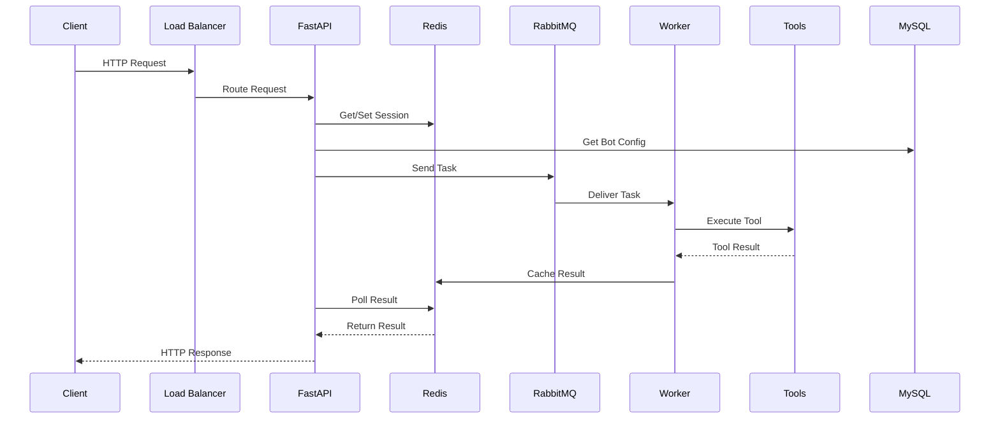

# 🏗️ Robot AI Workflow - Sơ đồ Kiến trúc Tổng thể

## 📊 **Tổng quan Hệ thống**

**Robot AI Workflow** là một **enterprise-grade chatbot system** với kiến trúc **microservices** phức tạp, được thiết kế để xử lý **multi-turn conversations**, **tool integration**, và **background task processing** với khả năng **horizontal scaling**.

---

## 🔍 **Phân tích Chi tiết từ Sơ đồ**

### **1. Client Layer (Tầng Khách hàng)**
```
┌─────────────────────┐
│   Client Apps       │
│ • Web Interface     │
│ • Mobile App        │  
│ • API Clients       │
└─────────────────────┘
```

**Đặc điểm:**
- **Multi-platform support** - Web, mobile, API clients
- **Load balancer** phân phối traffic
- **RESTful API** communication

### **2. API Gateway Layer (Tầng Cổng API)**
```
┌─────────────────────┐
│  FastAPI Server     │
│     (app.py)        │
│ • /bot/webhook      │
│ • /initConversation │
│ • /database/listBot │
│ • /runExtraction    │
└─────────────────────┘
```

**Chức năng chính:**
- **Request routing** và validation
- **Session management** với Redis
- **Task orchestration** với RabbitMQ
- **Multi-provider LLM** integration

### **3. Core Processing Layer (Tầng Xử lý Lõi)**

#### **A. Policies Workflow Engine**
```python
class PoliciesWorkflow:
    async def process(self, scenario, message, record):
        # 1. Intent Classification (LLM + Regex)
        # 2. Workflow State Management
        # 3. Tool Integration Decision
        # 4. Response Generation
```

**Workflow State Machine:**
- `NEXT_ACTION` - Hành động tiếp theo
- `CUR_ACTION` - Hành động hiện tại  
- `HISTORY_QUESTION` - Lịch sử câu hỏi
- **State transitions** dựa trên intent và context

#### **B. Scenario System**
```json
{
  "TITLE": "Learning Session",
  "FLOWS": {
    "greeting": [{"RESPONSE": ["Hello!"], "NEXT_ACTION": 1}],
    "pronunciation": [{"TOOL": "PRONUNCIATION_CHECKER", "NEXT_ACTION": 2}],
    "fallback": [{"RESPONSE": ["I don't understand"], "NEXT_ACTION": 0}]
  },
  "MAX_LOOP": 5
}
```

### **4. Caching Layer (Tầng Bộ nhớ đệm)**
```
┌─────────────────────┐
│    Redis Cache      │
│   (12GB LRU)        │
│ • Session Storage   │
│ • Task Results      │
│ • Memory Cache      │
└─────────────────────┘
```

**Redis Usage Patterns:**
- **Session persistence**: `{conversation_id}` → Full conversation object
- **Task results**: `{task_id}` → Tool execution results
- **User profiles**: `{conversation_id}_USER_PROFILE` → Profile data
- **Memory cache**: `{task_id}` → Memory generation results

### **5. Message Queue Layer (Tầng Hàng đợi Tin nhắn)**
```
┌─────────────────────┐
│     RabbitMQ        │
│ • Direct Exchange   │
│ • Persistent Msgs   │
│ • Health Checks     │
└─────────────────────┘
```

**Queue Architecture:**
- **Exchange**: `robot_ai_workflow_exchange`
- **Queue**: `robot_ai_workflow_queue`
- **Routing**: Direct routing với queue name
- **Durability**: Persistent messages và queues

### **6. Worker Layer (Tầng Xử lý Nền)**
```
┌─────────────────────┐
│   Worker Pool       │
│   (10 Replicas)     │
│ • Tool Processing   │
│ • Profile Extract   │
│ • Memory Generation │
└─────────────────────┘
```

**Background Tasks:**
1. **USER_PROFILE** - Profile extraction từ conversation
2. **CALLBACK_TOOL** - Tool execution (pronunciation, grammar)
3. **PIKA_MEMORY** - Memory generation với mem0

### **7. Tool System (Hệ thống Công cụ)**
```
┌─────────────────────┐
│   Tool Interface    │
│ • Pronunciation     │
│ • Grammar Checker   │
│ • Memory Gen        │
│ • Profile Extract   │
└─────────────────────┘
```

**Tool Integration:**
- **Async processing** trong background workers
- **Result caching** trong Redis
- **External API calls** với timeout handling
- **Error recovery** mechanisms

### **8. External Services (Dịch vụ Bên ngoài)**

#### **A. LLM Providers**
- **OpenAI GPT** - Primary LLM
- **Groq** - Fast inference
- **Gemini** - Google's LLM
- **Multi-provider fallback** strategy

#### **B. External APIs**
- **Profile Service** - User profile management
- **Memory Service** - Long-term memory với mem0
- **Tool Executor** - External tool processing

#### **C. Database Layer**
- **MySQL** - Bot configurations, user data, scenarios
- **Persistent storage** cho system state
- **ACID compliance** cho data integrity

---

## 🔄 **Data Flow Analysis (Phân tích Luồng Dữ liệu)**

### **1. Request Processing Flow**


### **2. Conversation State Management**
```python
# Session Storage Pattern
conversation = {
    "conversation_id": "uuid",
    "bot_config": {...},
    "history": [...],
    "record": {
        "NEXT_ACTION": 1,
        "CUR_ACTION": 0,
        "HISTORY_QUESTION": [...],
        "LANGUAGE": "en",
        "MOOD": "friendly"
    },
    "input_slots": {...}
}

# Redis Storage
REDIS_CLIENT.set(conversation_id, json.dumps(conversation))
```

### **3. Tool Execution Pipeline**
```python
# 1. Task Creation
task = {
    "task_name": "CALLBACK_TOOL",
    "conversation_id": conversation_id,
    "tool": {
        "key": "PRONUNCIATION_CHECKER_TOOL",
        "value": {
            "text_refs": "Hello world",
            "threshold": 0.8
        }
    },
    "audio_url": "https://...",
    "message": user_message
}

# 2. Queue Submission
rabbitmq_client.send_task(json.dumps(task))

# 3. Worker Processing
async def process_function_callback_tool(data):
    result = await tool_interface.process(...)
    redis_client.set(task_id, json.dumps(result))

# 4. Result Polling
while True:
    result = REDIS_CLIENT.get(task_id)
    if result: break
    await asyncio.sleep(0.1)
```

---

## 💡 **Architectural Strengths (Điểm Mạnh Kiến trúc)**

### **1. Scalability (Khả năng Mở rộng)**
- ✅ **Horizontal scaling** với 10 worker replicas
- ✅ **Stateless API servers** cho easy scaling
- ✅ **Redis clustering** support
- ✅ **RabbitMQ clustering** cho high availability

### **2. Performance (Hiệu suất)**
- ✅ **Async/await** throughout the system
- ✅ **In-memory caching** với Redis
- ✅ **Background processing** không block main thread
- ✅ **Connection pooling** và resource optimization

### **3. Reliability (Độ tin cậy)**
- ✅ **Message persistence** trong RabbitMQ
- ✅ **Session persistence** trong Redis
- ✅ **Health checks** cho all services
- ✅ **Retry mechanisms** trong workers
- ✅ **Graceful error handling**

### **4. Flexibility (Tính linh hoạt)**
- ✅ **Plugin-based tool system**
- ✅ **Multi-provider LLM support**
- ✅ **Scenario-driven conversations**
- ✅ **Configurable workflows**
- ✅ **Multi-modal support** (text, audio, image)

### **5. Maintainability (Khả năng Bảo trì)**
- ✅ **Separation of concerns**
- ✅ **Microservices architecture**
- ✅ **Docker containerization**
- ✅ **Configuration management**

---

## ⚠️ **Potential Issues & Improvements**

### **1. Performance Bottlenecks**
```python
# Issue: Polling pattern for task results
while True:
    result = REDIS_CLIENT.get(task_id)
    if result: break
    await asyncio.sleep(0.1)  # CPU intensive

# Solution: WebSocket or Server-Sent Events
async def stream_task_result(task_id):
    async for result in redis_stream(task_id):
        yield result
```

### **2. Single Points of Failure**
```yaml
# Issue: Single Redis instance
redis:
  image: redis:7.2.4

# Solution: Redis Cluster
redis-cluster:
  image: redis:7.2.4-cluster
  replicas: 3
```

### **3. Resource Management**
```python
# Issue: No connection pooling
redis_client = redis.StrictRedis(...)

# Solution: Connection pool
redis_pool = redis.ConnectionPool(max_connections=20)
redis_client = redis.Redis(connection_pool=redis_pool)
```

### **4. Monitoring & Observability**
```python
# Missing: Metrics and tracing
# Add: Prometheus + Grafana + Jaeger
import prometheus_client
from opentelemetry import trace

request_counter = prometheus_client.Counter('requests_total')
tracer = trace.get_tracer(__name__)
```

---

## 🎯 **Recommendations for Production**

### **1. Infrastructure Improvements**
- **Redis Cluster** cho high availability
- **RabbitMQ Cluster** với multiple nodes
- **Load balancer** với health checks
- **Auto-scaling** cho workers based on queue depth

### **2. Performance Optimization**
- **Connection pooling** cho all external services
- **Async RabbitMQ client** (aio-pika)
- **Database connection pooling**
- **CDN** cho static assets

### **3. Security Enhancements**
- **TLS encryption** cho all communications
- **API authentication** và authorization
- **Message encryption** cho sensitive data
- **Network segmentation** với VPC

### **4. Monitoring & Alerting**
- **Prometheus metrics** cho system health
- **Grafana dashboards** cho visualization
- **ELK stack** cho centralized logging
- **PagerDuty** cho incident management

### **5. Disaster Recovery**
- **Database backups** với point-in-time recovery
- **Redis persistence** configuration
- **Multi-region deployment**
- **Automated failover** mechanisms

---

## 📋 **Conclusion**

**Robot AI Workflow** thể hiện một **enterprise-grade architecture** với:

🏆 **Excellent design patterns** - Microservices, async processing, caching strategies  
🏆 **Production-ready features** - Health checks, persistence, error handling  
🏆 **Scalable architecture** - Horizontal scaling, stateless design  
🏆 **Flexible framework** - Plugin tools, multi-provider LLM, scenario-driven  

Đây là một **solid foundation** cho **complex conversational AI applications** với khả năng **handle high throughput** và **complex workflow processing**. Với một số **improvements** về **monitoring**, **security**, và **performance optimization**, hệ thống này có thể **scale** để phục vụ **enterprise-level workloads**.